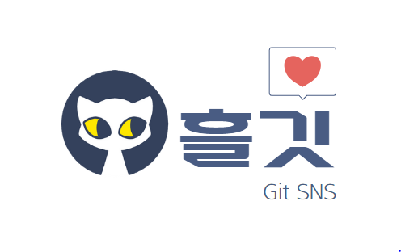
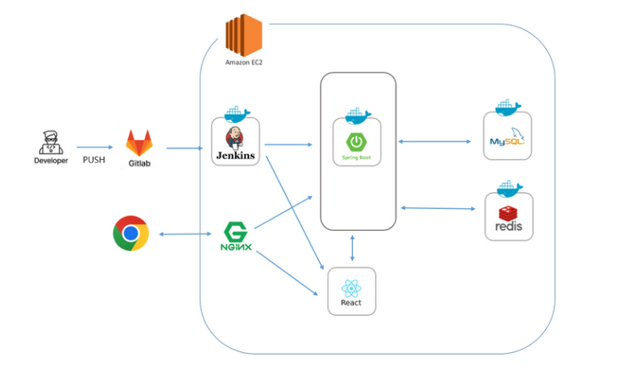
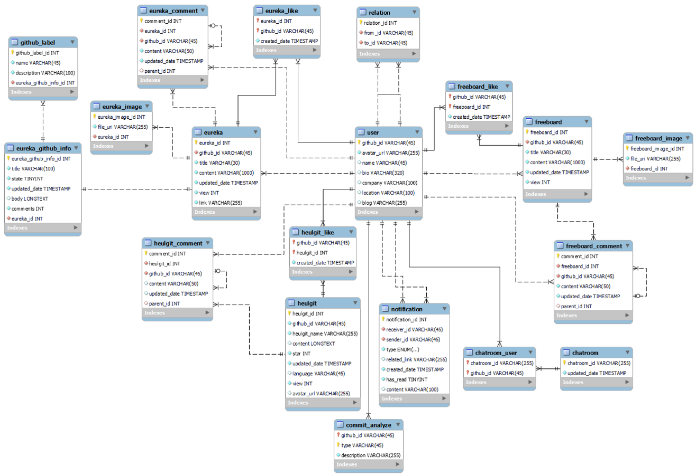
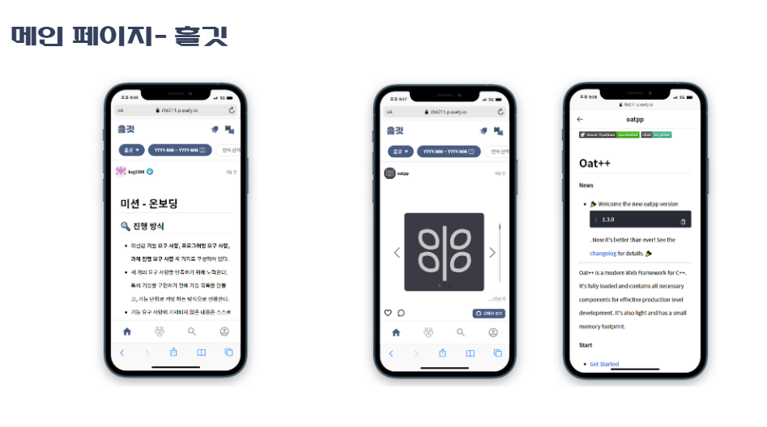
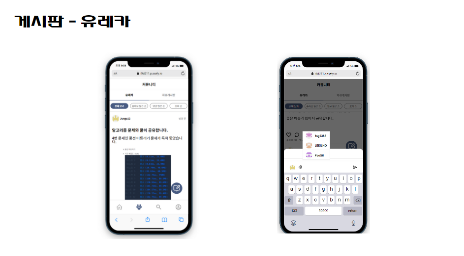
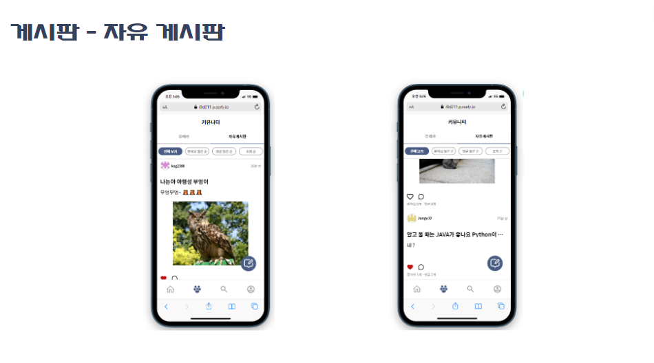
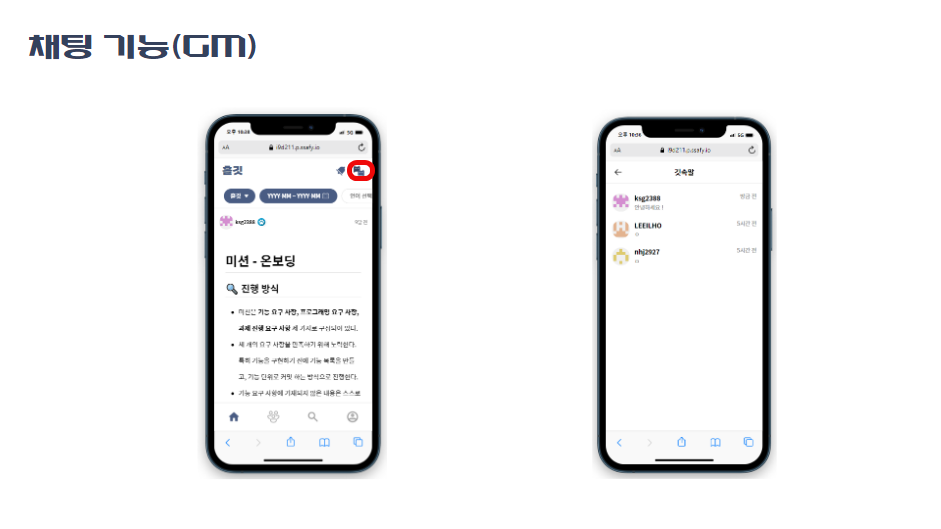
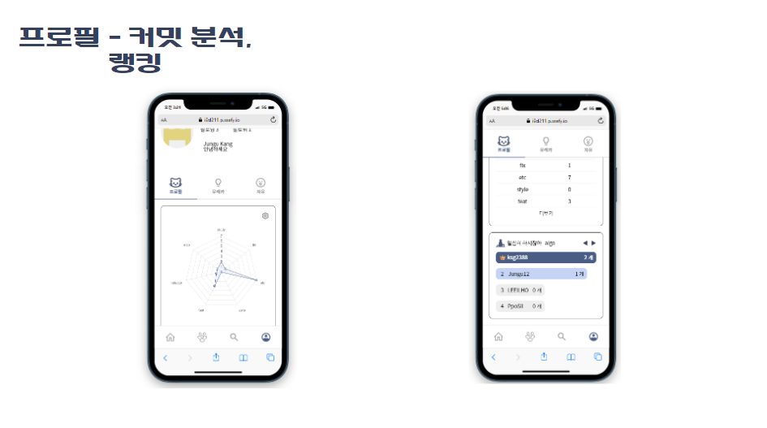

# Heulgit

## Heulgit ?
**Heulgit**은 GitHub 공식 API를 통해 얻은 GitHub의 다양한 정보를 활용하여 
대화의 장을 제공하는 개발자 커뮤니티입니다.

## 🛠 Tech Stacks
- `공통` - OAuth 2.0
- `Front` - React, TypeScript, Redux, React-Query, styled-components, yarn,
- `Back` - Java, Springboot, Spring Security, Swagger, JUnit, Gradle
- `DB` - MySQL
- `채팅` - Socket.io, Redis
- `Deploy` - AWS EC2, RDS, S3, Nginx, Jenkins, Docker
- `Cooperation` - Figma, Jira, GitLab, Mattermost, Notion

## 🔌 Infrastructures

## 📈 ERD

## 🏠 Members
- Backend (Spring Boot)
    - 강준구 (https://github.com/Jungu12)
    - 이일호 (https://github.com/LEEILHO)

- Front (React)
    - 김상근 (https://github.com/ksg2388)
    - 백승은 (https://github.com/se0987)
    - 안솔비 (https://github.com/PpoSil)

## 핵심 기능 엿보기

유익한 Repository + Follow 중인 유저의 Repository를 흘깃만의 알고리즘으로 큐레이션 서비스를 제공합니다.

공유하고 싶은 Issue나 Pull Request의 링크와 사진을 함께 첨부하여 글을 작성하는 유레카 게시판입니다.
댓글에서는 사용자 맨션 기능도 제공합니다.

자유롭게 글을 작성하고 소통하는 자유 게시판 입니다.

흘깃의 메세징 기능인 GM(Git Message)입니다.

사용자 프로필 화면에서는 사용자의 커밋을 분석하고 팔로우한 유저들간의 랭킹을 시각화하여 보여줍니다.
